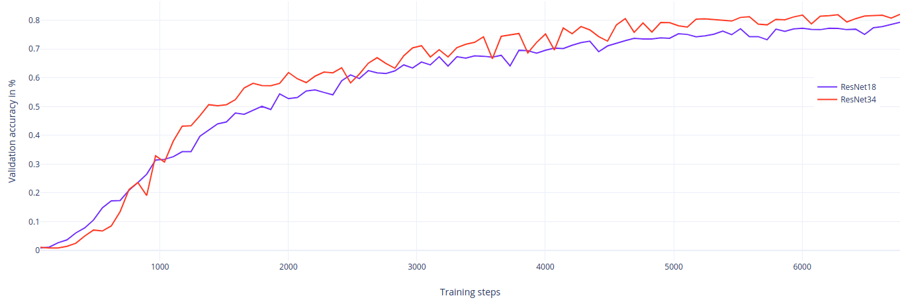

### Stockwell Deep Learning challenge 

## Overview

This project solves a classification problem where we identify the product id given an image. 

To solve this problem, I use the cropped image from the original image and trained a neural network to predict the normalized product ID.

For this problem, I choose to use ResNet architectures because they are the state-of-the art in image classification, in terms of [performance](https://arxiv.org/pdf/1905.00546v1.pdf) and [theoretical guarantees](https://arxiv.org/pdf/1811.03804.pdf).

Regarding the loss function, I use a cross-entropy loss because this classification problem fits a multinomial data distribution. In addition to this loss, regularization losses can be added if we choose to perform weight regularization.

To avoid overfitting, regularization is used as well as data augmentation. Batch normalization is also used in the resnet architecture instead of layer normalization which does not use the batch statistics and known to not work well with convnets. I do not use dropout to avoid [its problem](https://arxiv.org/pdf/1801.05134.pdf) with batch normalization.


## Implementation

This project was tested using **Tensorflow 2.0** and **Python 3.6**. 

To install all dependencies 
```
pip install -r requirements.txt
```

# Code description

This project contains the following files: 
- `datasets.py` : This is where the input pipeline is defined. It uses most of the code provided by Stockwell with minor changes
- `models_factory.py` : contains helper functions to create different versions of ResNet architectures
- `resnet.py`: This is the implementation of ResNet architectures using TF and Keras
- `optimizers`: helper functions to create an optimizer
- `train_and_evaluate.py`: This is the  script used for training and evaluating the model. It defined an end to end pipeline to train and evaluate in TF2.0

To run the training with the default settings,
```
python train_and_evaluate.py -o your_output_directory --data_path your_data_path
```

There are other flags that you can specify, for example
- `batch_size`: Training batch size
- `epochs` : the number of training epochs
- `augment`: whether or not to use data augmentation for training
- `model_name`: the model to train (resnet18, resnet34, resnet50, resnet101, resnet152)
- `weight_decay`: weight regularization for training

For example, the command used to train the resnet18 model is 
```
python train_and_evaluate --batch_size 64 --epochs 100 --lr 3e-4 --opt adam --data_path your_data_path
```

<br />
<div align="center">

<br />

